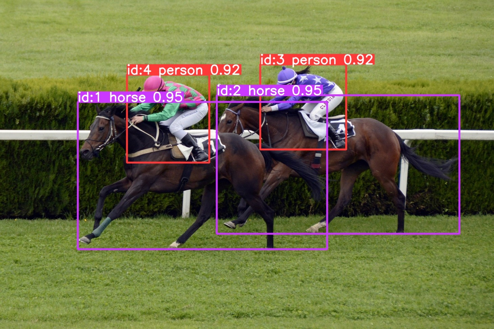

<div align="center">

# Bitscoper Visionoscope

Object Detection, Object Segmentation, and Pose Detection using Ultralytics YOLO26 on Streamlit

<br />



</div>

## Usage

```sh
python3.11 -m venv ./.venv

source ./.venv/bin/activate

pip3.11 install -r requirements.txt

python3.11 -m streamlit run main.py
```

If you encounter the error `Original error was: libstdc++.so.6: cannot open shared object file: No such file or directory` on NixOS, try running:

```sh
NIXPKGS_ALLOW_UNFREE=1 nix-shell -p steam-run --run "steam-run python3.11 -m streamlit run main.py"
```
