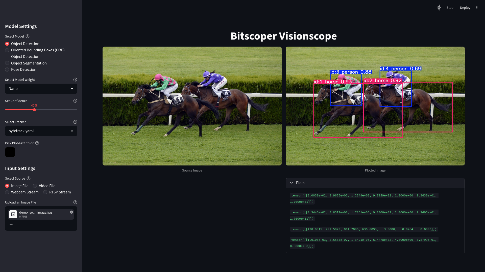
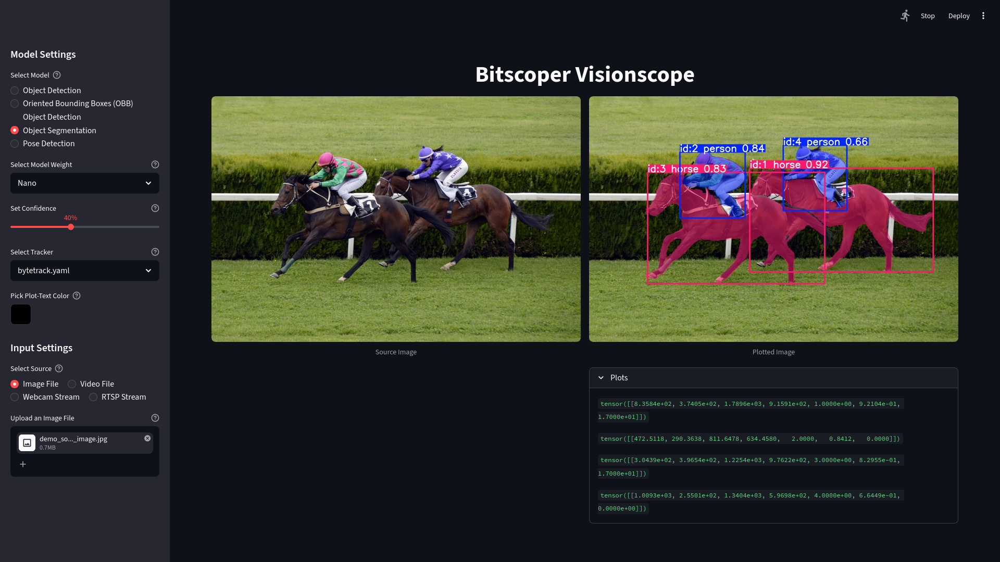
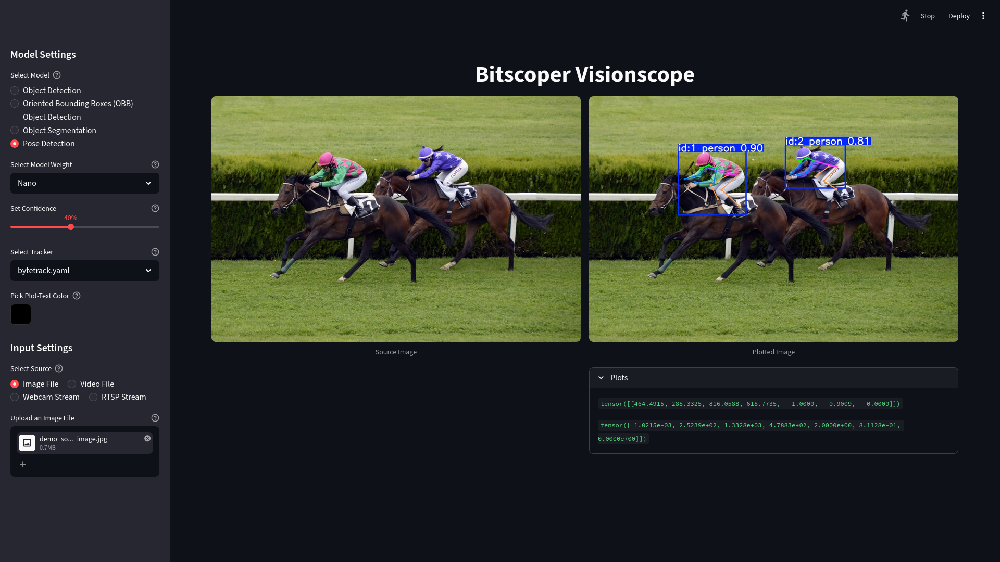

<div align="center">

# Bitscoper Visionoscope

Object Detection, Oriented Bounding Boxes (OBB) Object Detection, Object Segmentation, and Pose Detection from Image Files, Video Files, Webcams, and RTSP Streams Using Ultralytics YOLO26 in Streamlit

</div>

## Screenshots



---



---



## Usage

```sh
python3.12 -m venv ./.venv

source ./.venv/bin/activate

pip3.12 install -r requirements.txt

python3.12 -m streamlit run main.py
```

If you encounter the error `Original error was: libstdc++.so.6: cannot open shared object file: No such file or directory` on NixOS, try running:

```sh
nix-shell -p steam-run-free --run "steam-run python3.12 -m streamlit run main.py"
```
